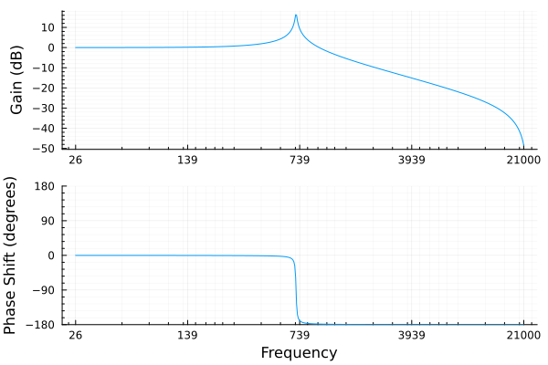

# Zform

Some simple Julia scripts to analyze and plot the behaviour of different
digital filters.

## Run

Install dependencies:
```
julia --project=.
```

Then in the repl press `]` to go to `pkg` and then:

```
instantiate
```

Or `update` to update deps.

Run the script with:

```
julia --project=. main.jl
```

## Example plots

### All-pass filter


### Band-pass filter


### Resonant low-pass biquad



### All-pass pole discontinuity


